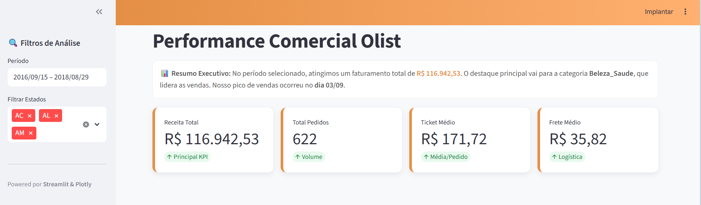
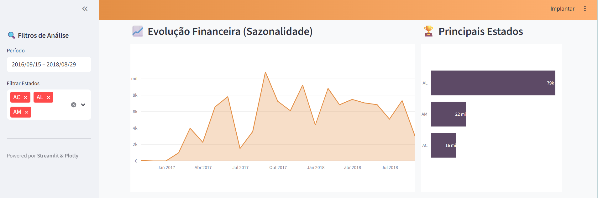
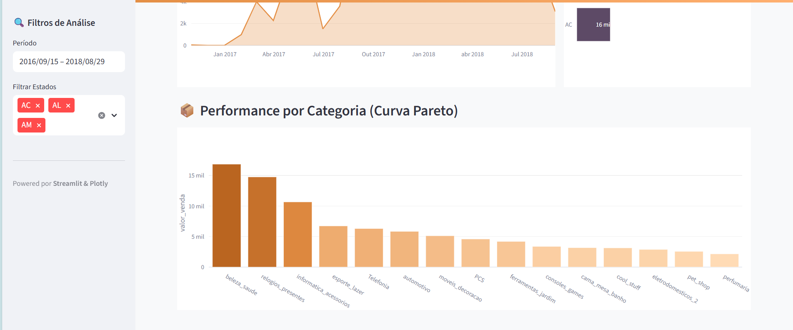

# 📊 Monitoramento de Performance de Vendas - Olist

## 📖 Sobre o Projeto
Este projeto simulou um desafio real de **Business Intelligence**. O objetivo foi atuar como parceiro da Diretoria de Marketing da Olist para resolver a falta de visibilidade sobre os dados de vendas, essencial para o planejamento do budget anual.

A solução consistiu em processar dados brutos via SQL e construir um Dashboard interativo com Python para tomada de decisão.

## 🎯 O Problema de Negócio
A diretoria precisava responder a 3 perguntas estratégicas:
1.  **Tendência Temporal:** Qual a sazonalidade das vendas e evolução mensal?
2.  **Geografia (Geo-Marketing):** Onde estão os melhores clientes?
3.  **Mix de Produtos:** Quais categorias são os "Carros-Chefe" da empresa?

---

## 🖥️ Tour pelo Dashboard

### 1. Visão Executiva (KPIs)
Resumo imediato da performance. O dashboard calcula automaticamente a Receita Total (R$ 116k), Ticket Médio e Frete, além de gerar um resumo com IA sobre a categoria destaque ("Beleza_Saude").


### 2. Análise Temporal e Geográfica
Gráficos que respondem "Quando" e "Onde" as vendas ocorrem.
* **Sazonalidade:** Picos de venda visíveis no gráfico de área.
* **Geografia:** Ranking dos estados (SP, RJ, MG) para direcionamento de tráfego pago.


### 3. Análise de Produto (Curva Pareto)
Identificação das categorias que trazem maior retorno financeiro. Note que "Beleza e Saúde" e "Relógios" lideram o faturamento.


---

## ⚙️ A Solução Técnica (Bastidores)

### Engenharia de Dados (SQL)
O script `ProjetofinalOlist.sql` é o coração da análise. Ele transforma os dados brutos aplicando:
* **Limpeza:** Filtro estrito por `order_status = 'delivered'` (apenas vendas concretizadas).
* **Regra de Negócio:** Criação da métrica de *Faturamento Real* (`price` + `freight_value`).
* **Modelagem:** Unificação de 4 tabelas (Pedidos, Itens, Produtos, Clientes) em uma View Analítica.

### Stack Tecnológico
* **SQL (PostgreSQL):** Extração e tratamento de dados (ETL).
* **Python (Streamlit + Plotly):** Desenvolvimento da aplicação Web interativa (`app.py`).
* **Git/GitHub:** Versionamento e documentação.

---

## 🚀 Como Executar
1.  Certifique-se de ter os dados da Olist carregados no seu banco.
2.  Rode o script SQL `ProjetofinalOlist.sql` para gerar a base.
3.  Instale as bibliotecas Python:
    ```bash
    pip install streamlit plotly pandas
    ```
4.  Execute a aplicação:
    ```bash
    streamlit run app.py
    ```

---
*Desenvolvido como parte do portfólio de Dados.*
