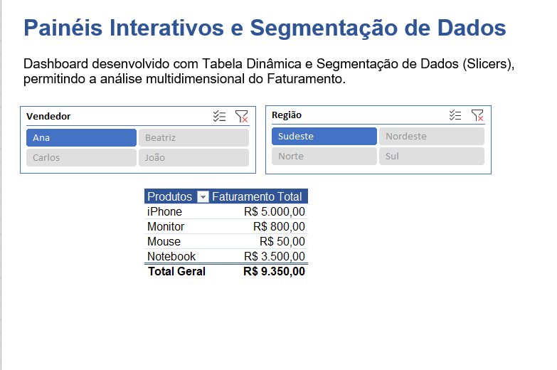
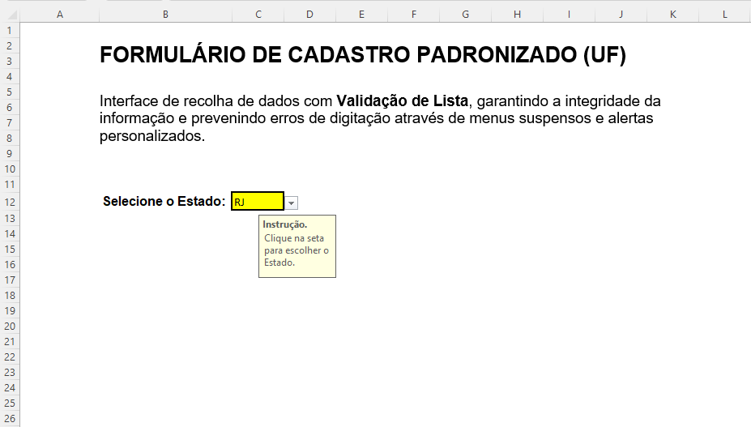
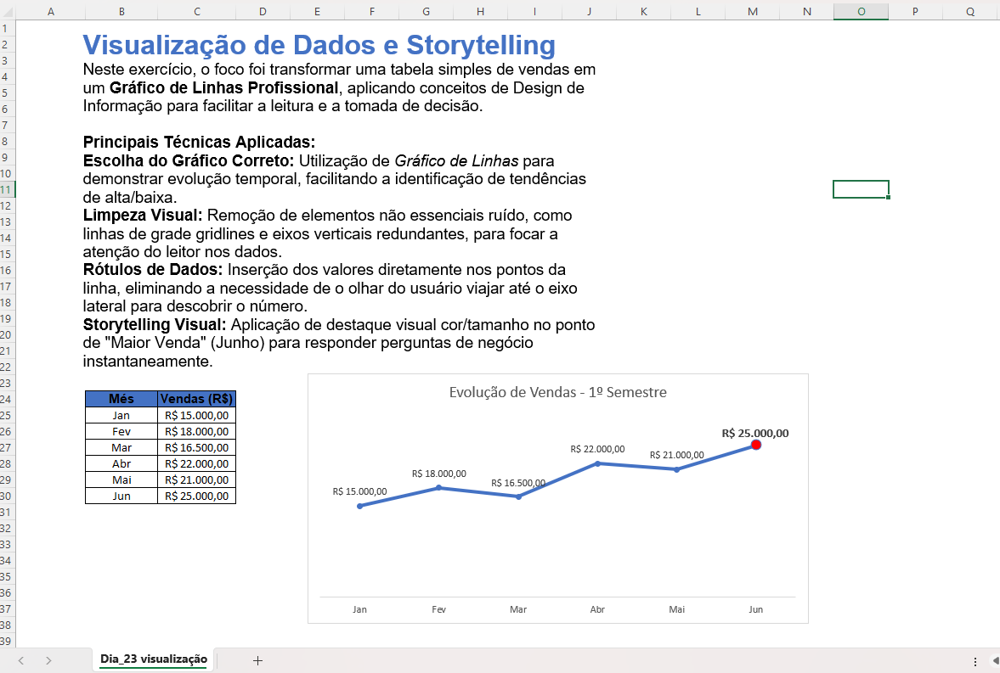
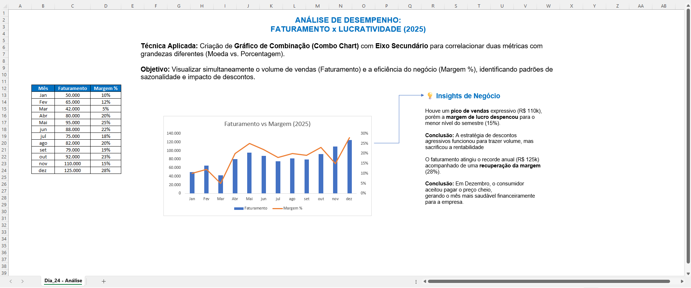
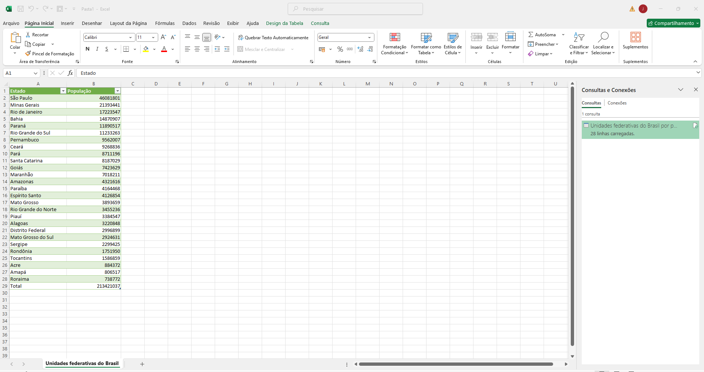
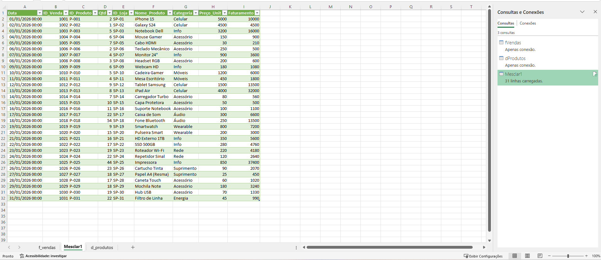
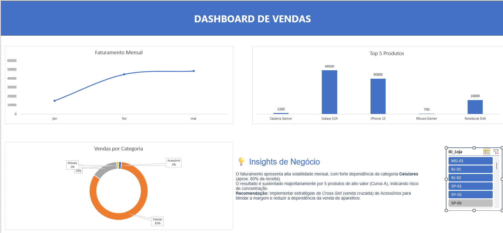

# 📊 Jornada Excel para Análise de Dados

> **Status do Projeto:** 🚀 Em Andamento (Dia 22/30)

Este repositório documenta minha jornada intensiva de aprendizado em **Excel for Data Science**. O objetivo é dominar desde a estruturação de dados brutos até a criação de Dashboards Gerenciais interativos e automatizados.

---

## 📚 Módulo 1: Fundamentos e Estruturação (Dias 1-7)
**Foco:** Tratamento de dados, operações matemáticas e visualização básica.

### 🛠️ Projeto: Relatório de Estoque e Precificação
Transformação de uma lista de dados brutos em um relatório gerencial automatizado.

- **Tratamento de Dados:** Padronização de tipos (Texto vs. Números) e limpeza de layout (UI Design).
- **Fórmulas:** Criação de colunas calculadas e uso de funções de agregação (`SOMA`, `MÉDIA`, `MÁXIMO`) para rodapé de BI.
- **Referências Absolutas ($):** Implementação de taxas dinâmicas com travamento de células.
- **Data Visualization (Dia 7):** Criação de gráficos de colunas com foco em Storytelling e *Data Ink Ratio* (limpeza visual).

---

## 🧠 Módulo 2: Lógica e Manipulação de Texto (Dias 8-14)
**Foco:** Automatizar regras de negócio e higienizar bases de dados.

- [x] **Dia 8: Lógica Condicional (`SE`)**
  - Criação de Boletim Escolar com classificação automática baseada em critérios numéricos.
  - *Arquivo:* `Dia_08_Logica_SE.xlsx`

- [x] **Dia 9: Análise Seletiva (`SOMASE` e `CONT.SE`)**
  - Resumo de vendas por vendedor e contagem de ocorrências (frequência).
  - Prática de *Debugging* de fórmulas.
  - *Arquivo:* `Dia_09_Condicionais.xlsx`

- [x] **Dia 10: Lógica Avançada (`E`, `OU`, `SE Aninhado`)**
  - Regras de bônus com múltiplos critérios e sistema de medalhas (Nested IF).
  - Indicadores visuais com Formatação Condicional.
  - *Arquivo:* `Dia_10_Logica_Avancada.xlsx`

- [x] **Dias 11-12: Engenharia de Texto (`ESQUERDA`, `LOCALIZAR`, `ARRUMAR`)**
  - Pipelines de limpeza de texto e extração dinâmica de nomes/sobrenomes.
  - *Arquivo:* `Dias_11_12_Manipulacao_Texto.xlsx`

- [x] **Dias 13-14: Engenharia Temporal (`DATADIF`, `HOJE`, Lógica de Horas)**
  - Cálculo de prazos, idades exatas e gestão de turnos (cálculo de horas noturnas).
  - *Arquivo:* `Dia_13_Datas_e_Revisao.xlsx` | `Dia_14_Logica_e_Cores.xlsx`

---

## 🔍 Módulo 3: Consultas e Cruzamento de Dados (Dias 15-17)
**Foco:** Conectar bases de dados diferentes (Relacional).

- [x] **Dias 15-16: Sistema de Consulta (`PROCV` e `SEERRO`)**
  - Criação de ferramenta de "Frente de Caixa", separando Back-end (Dados) de Front-end (UI).
  - Blindagem de erros para códigos inexistentes.

- [x] **Dia 17: O Moderno `PROCX` (XLOOKUP)**
  - Buscas bidirecionais e matrizes dinâmicas, superando limitações do PROCV.
  - *Arquivo:* `Dia_16_17 Sistema de Consulta_PROCX.xlsx`

---

## 📊 Módulo 4: Business Intelligence e Dashboards (Dias 18-22)
**Foco:** Transformar dados em tomadas de decisão visuais.

### 📉 Dias 18-19: Análise de Vendas e Pareto
- **Pivot Tables:** Sumarização de bases de vendas com agrupamento temporal.
- **Análise de Pareto (80/20):** Identificação de produtos "Curva A" (Campeões de Venda) e cálculo de Market Share.
- **Storytelling:** Relatório executivo mostrando que **98% do faturamento** provém de 2 SKUs.
- *Arquivos:* `Dia_18_Dashboard_Vendas.xlsx`, `Dia_19_Final.xlsx`

### 🖥️ Dia 21: Dashboard Interativo (Slicers)

- **Interatividade:** Implementação de **Segmentação de Dados (Slicers)** para filtragem por Região/Vendedor.
- **UI/UX:** Design limpo, remoção de grades e identidade visual corporativa (Azul).
- **Resultado:** Painel dinâmico de faturamento por produto.
- *Arquivo:* `Dashboard_Vendas_Dia21.xlsx`

### 🛡️ Dia 22: Data Quality e Validação

- **Objetivo:** Garantir a qualidade dos dados na fonte (Input).
- **Técnica:** Criação de **Listas Suspensas (Dropdowns)** e travas de segurança.
- **UX:** Mensagens de instrução (Input Message) e Alertas de Erro personalizados.
- *Arquivo:* `Dia22_Validacao_de_Dados.xlsx`

---

## 🛠️ Stack Tecnológica
* **Microsoft Excel** (Office 365)
* **Conceitos:** ETL (Extract, Transform, Load), Data Cleaning, UI/UX Design, Dashboarding.

---
### 📈 Dia 23: Data Storytelling e Gráficos Essenciais

- **Objetivo:** Transformar dados brutos em insights visuais claros, saindo do padrão "automático" do Excel.
- **Técnica:** Criação de **Gráfico de Linhas** para análise temporal (Tendência de Vendas).
- **Design (Data-Ink Ratio):** Aplicação de limpeza visual extrema (remoção de gridlines, bordas e eixos redundantes) para reduzir a carga cognitiva.
- **Storytelling:** Uso estratégico de **Destaque Visual** (cor e tamanho diferenciados) no ponto de máximo (Junho), guiando o olhar do tomador de decisão para o insight principal.
- *Arquivo:* `Dia23_Visualizacao_Dados.xlsx`
*Desenvolvido por **Jéssica Rocha** 👩‍💻*
---
### 📊 Dia 24: Gráficos de Combinação e Análise de Margem

- **Desafio de Negócio:** Comparar duas métricas com escalas muito diferentes: *Faturamento* (Valores absolutos altos) e *Margem de Lucro* (Porcentagem pequena), identificando a relação entre volume de vendas e rentabilidade.
- **Técnica:** Construção de **Gráfico de Combinação (Combo Chart)** utilizando **Eixo Secundário** para visualização simultânea das duas grandezas sem distorção.
- **Storytelling com Dados:**
    - Identificação visual do "Efeito Black Friday" (Pico de vendas com queda de margem).
    - Uso de elementos visuais (**Setas e Callouts**) para conectar os pontos de dados diretamente aos insights de negócio, facilitando a leitura executiva.
- *Arquivo:* `Dia24_Grafico_Combo_Analise.xlsx`
---

### 🧹 Dia 25: Introdução ao Power Query (ETL)

- **Desafio:** Importar dados reais da Web (Wikipédia) contendo formatação incompatível (espaços não-quebráveis como separadores de milhar) que impediam cálculos.
- **Ferramenta:** **Power Query** (Editor de Consultas do Excel).
- **Técnicas de ETL (Extract, Transform, Load) aplicadas:**
    - **Extração (Web Scraping):** Conexão direta com URL externa da Wikipédia para buscar a tabela de "Unidades Federativas".
    - **Transformação (Cleaning):**
        - Remoção de colunas desnecessárias.
        - Uso da inteligência artificial **"Coluna de Exemplos"** para ensinar o Excel a limpar caracteres especiais ocultos (espaço não-quebrável).
        - Conversão de tipos de dados (Texto -> Número Inteiro).
    - **Carga:** Disponibilização dos dados tratados em Tabela Excel pronta para análise.
- *Arquivo:* `Dia25_PowerQuery_Intro.xlsx`
- 
--- 

### 🔗 Dia 26: Mesclar Consultas (O "PROCV" do Power Query)

- **Desafio:** Unificar dados de duas tabelas distintas ("Fato Vendas" e "Dimensão Produtos") para calcular o faturamento total, sem utilizar fórmulas pesadas como PROCV ou PROCX.
- **Técnica:** **Merge Queries (Mesclar Consultas)** no Power Query (equivalente ao *Left Join* em SQL).
- **Passo a Passo:**
    1.  **Conexão:** Importação das tabelas `fVendas` e `dProdutos` apenas como conexão (para economizar memória).
    2.  **Mesclagem:** Cruzamento das tabelas usando a chave única `ID_Produto`.
    3.  **Expansão:** Seleção apenas das colunas necessárias (Nome, Categoria, Preço) da tabela dimensão.
    4.  **Cálculo:** Criação de Coluna Personalizada (`Qtd * Preço`) dentro do editor ETL.
- *Arquivo:* `Dia26_Mesclar_Consultas.xlsx`
---

### 🔗 Dia 27: 📊 Dashboard de Vendas - Excel

Dashboard interativo desenvolvido para análise de performance de vendas, sazonalidade e mix de produtos.

*(Certifique-se de que o nome da imagem aqui seja igual ao arquivo que você subiu)*

## 🛠️ Tecnologias Utilizadas
* **Microsoft Excel:** Tabelas Dinâmicas (Pivot Tables), Gráficos Dinâmicos, Segmentação de Dados (Slicers) e Tratamento de Dados (ETL simples).

## 💡 Insights de Negócio
Com base na análise dos dados (cenário Loja SP-01 e Geral), identificou-se:

* **Risco de Concentração:** A receita é altamente dependente da categoria **Celulares** (~80%). Uma queda na demanda deste setor impactaria drasticamente o resultado.
* **Volatilidade Mensal:** A performance apresenta oscilações bruscas (Picos e Vales), sem tendência de crescimento estável.
* **Pareto (Curva A):** O faturamento é sustentado por apenas **5 produtos** de alto ticket (Galaxy S24, iPhone 15, etc).
* **Ação Recomendada:** Estratégia de *Cross-Sell* (venda cruzada) de Acessórios para blindar a margem e reduzir a dependência da venda de aparelhos.

## 📂 Como visualizar
Baixe o arquivo `Dashboard_Vendas.xlsx` neste repositório para testar a interatividade dos filtros.
