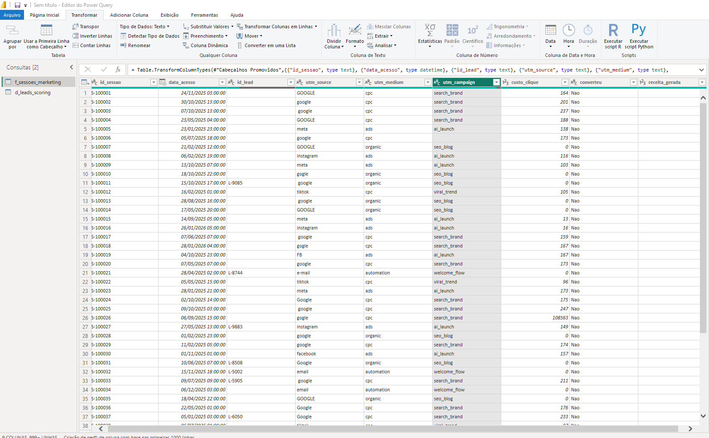
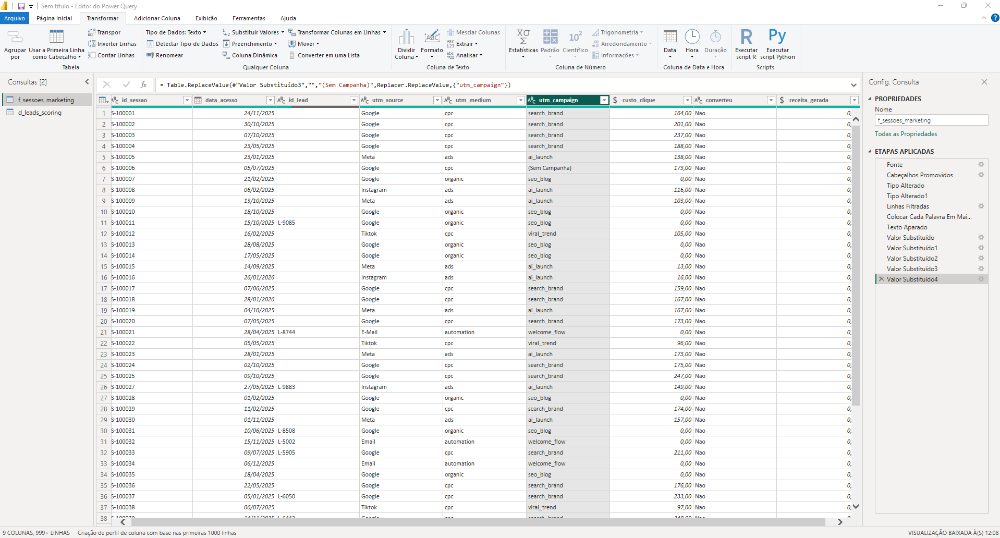
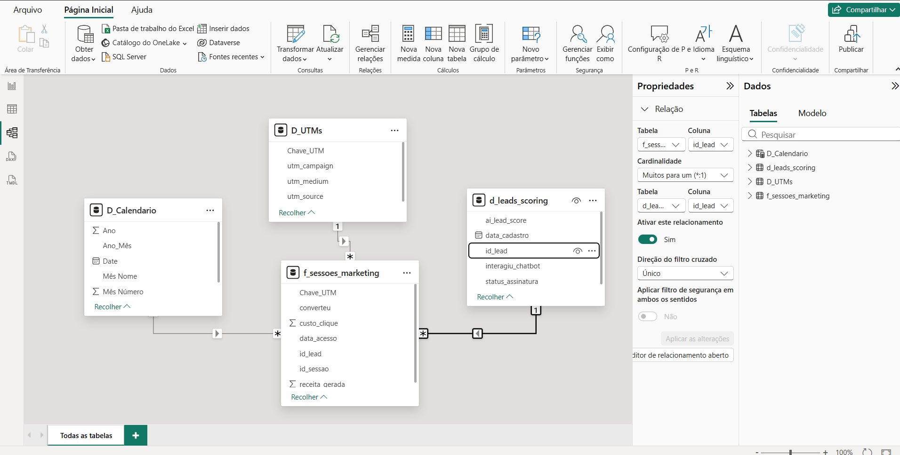

# 🧹 Dia 26: ETL e Modelagem de Dados - Dominando o Caos

No mundo real, os dados nunca chegam limpos. Para o projeto Nexus Growth, o desafio de hoje foi utilizar o **Power Query** para transformar arquivos CSV brutos, cheios de erros de digitação, valores nulos e anomalias sistêmicas, em um modelo de dados confiável e performático.

## 🛠️ 1. O Desafio (Dados Sujos)
Os dados extraídos das plataformas de marketing apresentavam inconsistências severas que quebrariam qualquer análise de ROAS:
* Erros de digitação nas UTMs (ex: "Gogle", "Fb").
* Outliers absurdos de Custo de Clique gerados por falhas de sistema.
* Leads duplicados e datas de cadastro corrompidas (ano 1900).

## 🧼 2. Transformação e Limpeza (Power Query)
Utilizei diversas etapas de transformação para garantir a governança dos dados:
1. **Padronização de Texto:** Funções de Capitalize, Trim e Replace Values para unificar as origens de tráfego.
2. **Remoção de Outliers:** Filtros condicionais para excluir cliques com custos irreais.
3. **Tratamento de Nulos:** Substituição de espaços em branco e valores `null` por categorias padronizadas ("Direto", "Sem Campanha").
4. **Desduplicação:** Remoção de IDs de leads duplicados para garantir a integridade dos relacionamentos (1:N).

## 🌟 3. A Modelagem: Star Schema
O passo mais crítico foi a normalização. Transformei arquivos *flat* (planilhões) em 4 tabelas relacionais eficientes:
* `F_Sessoes_Marketing`: Nossa tabela fato contendo apenas chaves e métricas.
* `D_UTMs`: Dimensão extraída via agrupamento de colunas da tabela fato.
* `D_Leads_Scoring`: Dimensão de usuários e notas de Inteligência Artificial.
* `D_Calendario`: Criada dinamicamente com DAX para inteligência temporal.

O resultado final foi um **Star Schema** perfeito, otimizado para os cálculos que desenvolveremos a seguir.

---
**Próximo Passo (Dia 27):** Criação das Medidas DAX (KPIs de Negócio, CAC, ROAS e Time Intelligence).
