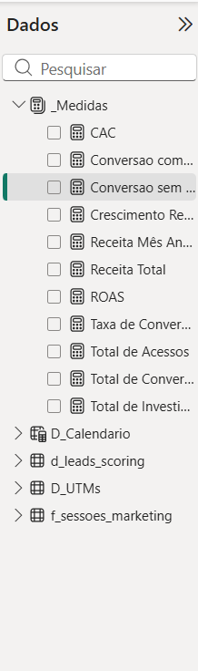
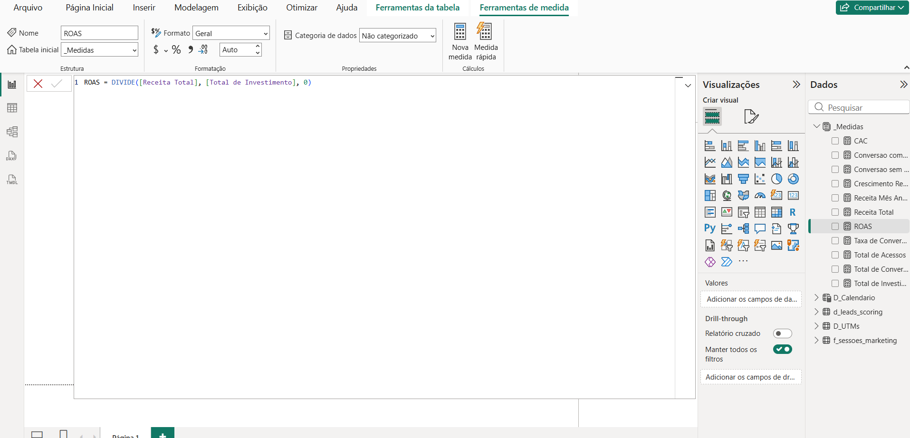

# 🧮 Dia 27: DAX Avançado - Construindo o Motor Analítico

Com o ETL e o modelo relacional (Star Schema) concluídos no Dia 26, o foco de hoje foi construir a "inteligência" do projeto Nexus Growth. O objetivo foi criar medidas DAX eficientes e escaláveis para responder às principais perguntas de negócio da diretoria.

## 🗂️ 1. Organização e Governança
A primeira etapa foi estabelecer boas práticas de modelagem criando uma tabela vazia (`_Medidas`) dedicada exclusivamente a armazenar os cálculos, separando-os das tabelas físicas e facilitando a manutenção do modelo.

## 📊 2. KPIs Fundamentais e Eficiência
Desenvolvi as métricas primárias para entender o volume de tráfego e conversão, e em seguida, cruzei esses dados para calcular a eficiência financeira das campanhas:

* **Tráfego e Conversão:** `Total de Acessos`, `Total de Conversoes`, `Taxa de Conversao`.
* **Financeiro:** `Total de Investimento`, `Receita Total`.
* **Eficiência de Custos:** `CAC` (Custo de Aquisição de Cliente) e `ROAS` (Retorno sobre Investimento Publicitário).

## ⏳ 3. Inteligência Temporal (Time Intelligence)
Para permitir análises comparativas e identificar tendências, utilizei as funções de Time Intelligence do DAX em conjunto com a tabela `D_Calendario`:

* `Receita Mês Anterior`: Utilizando `DATEADD` para deslocar o contexto de filtro.
* `Crescimento Receita %`: Calculando a variação Month-over-Month (MoM).

## 🤖 4. Análise de Produto (Eficácia do Chatbot IA)
O principal desafio de negócio era comprovar o ROI da ferramenta de Inteligência Artificial implementada no site. Através da função `CALCULATE`, criei métricas cruzando a tabela Fato de sessões com a Dimensão de Leads:

* `Conversao com Chatbot`: Isolando a taxa de conversão apenas dos usuários que interagiram com a IA.
* `Conversao sem Chatbot`: Para efeito de comparação direta e cálculo de *uplift*.

---
**Próximo Passo (Dia 28):** Criação de visualizações interativas e montagem do Dashboard final com foco em Storytelling.
