# 📊 Dia 01: Introdução ao Power BI

Bem-vindo(a) ao módulo de Power BI do meu bootcamp de 90 dias de Dados! 🚀

Neste primeiro dia, o foco foi estabelecer as bases do Business Intelligence e dar os primeiros passos na ferramenta Power BI Desktop.

## 📚 Introdução Teórica

### O que é Business Intelligence (BI)?
O BI não é apenas um software, mas um conjunto de estratégias e tecnologias que transformam dados brutos em informações visuais e acionáveis. O objetivo é permitir que os decisores de negócio analisem painéis (dashboards) e extraiam *insights* sem precisarem de analisar código ou bases de dados complexas.

### Interface do Power BI Desktop
A plataforma divide-se em três áreas principais de navegação:
1. **Exibição de Relatório (Report View):** O ecrã principal (canvas) onde arrastamos os visuais e construímos o dashboard.
2. **Exibição de Dados (Data View):** Uma visualização em formato de grelha (semelhante ao Excel) para explorar e validar as linhas e colunas importadas.
3. **Exibição de Modelo (Model View):** Onde gerimos os relacionamentos entre diferentes tabelas.

### O Fluxo de Trabalho (Workflow)
O trabalho padrão no Power BI segue geralmente 5 etapas:
1. **Obter Dados:** Ligar às fontes (Excel, SQL, Web, etc.).
2. **Transformar Dados:** Limpar e preparar os dados utilizando o Power Query.
3. **Modelagem:** Criar relações entre tabelas e métricas com a linguagem DAX.
4. **Visualização:** Construir gráficos e painéis interativos.
5. **Publicação:** Partilhar o relatório final no Power BI Service (nuvem).

---

## 💻 Exercício Prático do Dia

**Objetivo:** Realizar a importação de um ficheiro simples, explorar a interface e gerar o primeiro gráfico de forma intuitiva.

**Passos Realizados:**
1. **Criação da Base de Dados:** Criação de um ficheiro Excel (`Campanhas_Teste.xlsx`) contendo dados fictícios sobre campanhas de tráfego pago (Data, Campanha, Cliques, Valor Investido).
2. **Importação:** Ligação do Power BI ao ficheiro Excel local utilizando a funcionalidade "Obter Dados".
3. **Navegação:** Verificação dos dados importados através da *Exibição de Dados*.
4. **Visualização:** Criação de um gráfico de barras na *Exibição de Relatório*, arrastando os campos `Campanha` (Eixo) e `Cliques` (Valores) para o canvas, gerando a visualização automática de desempenho por campanha.

---

---

## 📊 Dia 02: Power Query e ETL (Extração, Transformação e Carga)

Neste segundo dia, o foco foi dominar a "cozinha" do Power BI: o Editor do Power Query. Aprendi como preparar dados do mundo real, que frequentemente chegam com formatações inadequadas de sistemas externos.

### 📚 Introdução Teórica

* **O que é ETL:** Processo de Extrair dados de uma fonte, Transformá-los (limpeza e modelagem) e Carregá-los no modelo do Power BI.
* **O Motor do Power Query:** Uma ferramenta que grava cada passo de limpeza num processo automatizado (Etapas Aplicadas). Se os dados originais mudarem, a limpeza é refeita com um clique.
* **Tipos de Dados:** A importância de definir corretamente o formato de cada coluna (Texto, Número Inteiro, Data/Hora) para permitir cálculos e filtros precisos.
* **Técnicas de Limpeza:** Como utilizar funções para remover linhas e colunas inúteis, preparando a tabela para um formato tabular perfeito.

### 💻 Exercício Prático do Dia

**Objetivo:** Ligar o Power BI a uma folha de cálculo "suja" (simulando a exportação de um sistema de automação de marketing com dados de *Lead Score*) e realizar a limpeza completa utilizando o Power Query.

**Passos Realizados:**
1. **Extração:** Ligação ao ficheiro `Leads_Sujo.xlsx`.
2. **Remoção de Sujidade:** Utilização da função *Remover Linhas Superiores* para apagar títulos inúteis gerados pelo sistema.
3. **Estruturação:** Aplicação da função *Usar a Primeira Linha como Cabeçalho* para definir as colunas corretamente.
4. **Limpeza Profunda:** Remoção de linhas em branco e exclusão de colunas nulas que não acrescentavam valor à análise.
5. **Tipagem:** Ajuste do tipo de dados da coluna `Score_Lead` para *Número Inteiro*.
6. **Carga:** Conclusão com "Fechar e Aplicar", disponibilizando os dados limpos para a criação de relatórios.

**Resultado da Limpeza no Power Query:** 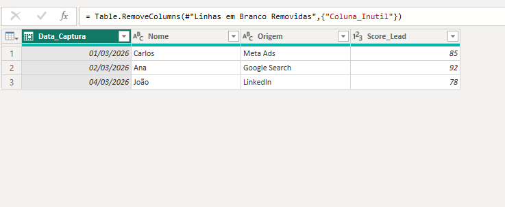

**Dados Carregados no Power BI:** 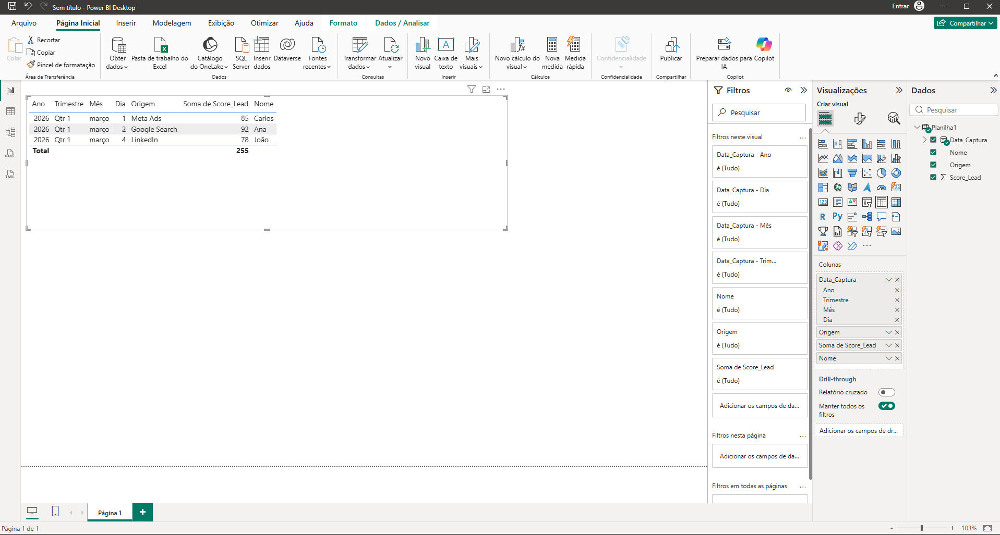

---
---

## 📊 Dia 03: Transformações Avançadas (Limpeza de Dados)

Neste terceiro dia, avancei para técnicas de nível intermediário/avançado no Power Query, focando em transformar relatórios gerenciais (feitos para leitura humana) em modelos tabulares (feitos para leitura de máquinas e bancos de dados).

### 📚 Introdução Teórica

* **Pivoting / Unpivoting:** A técnica de transformar "colunas em linhas". Muitas bases de dados financeiras ou de metas trazem períodos (ex: meses, anos) espalhados em várias colunas. O *Unpivot* condensa essas colunas numa estrutura longa, criando uma coluna de "Atributo" e uma de "Valor", essencial para a criação de inteligência de tempo (Time Intelligence).
* **Dividir Colunas (Split):** Utilização de delimitadores (como hífens, vírgulas ou espaços) para separar dados concatenados numa única célula, permitindo análises granulares (ex: separar o ID numérico do nome textual de uma campanha).

### 💻 Exercício Prático do Dia

**Objetivo:** Converter uma tabela de investimentos anuais "larga" (com os anos de 2024, 2025 e 2026 divididos em colunas) e IDs agrupados para o formato tabular perfeito.

**Passos Realizados:**
1. **Promoção de Cabeçalhos:** Ajuste da primeira linha para identificar corretamente os anos e a coluna de IDs.
2. **Divisão de Colunas:** Uso da ferramenta *Dividir por Delimitador* (hífen) para separar o código numérico (`ID`) do nome da `Campanha`.
3. **Unpivot:** Seleção das colunas âncora (ID e Campanha) e aplicação de *Transformar Outras Colunas em Linhas*, condensando os anos espalhados numa única coluna.
4. **Tipagem e Renomeação:** Ajuste dos tipos de dados (Ano como Texto, Investimento como Número Inteiro) para garantir o funcionamento correto de agregações matemáticas no relatório final.

**Resultado da Transformação (Unpivot & Split):** 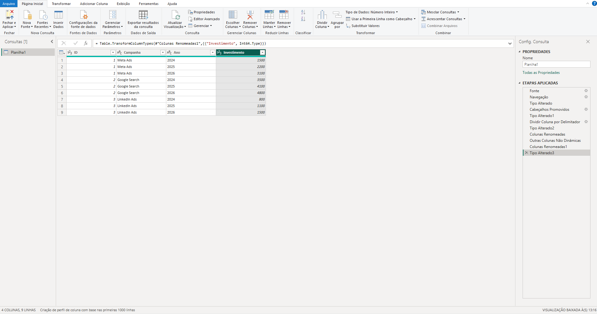

--- 
---

## 📊 Dia 04: Tratamento de Erros e Desafio Master de ETL

Neste quarto dia, enfrentei o cenário mais comum e temido do mundo dos dados: falhas humanas e sistemas despadronizados. Para testar minhas habilidades de ponta a ponta, criei um script em **Python** que gerou um dataset de 500 linhas contendo intencionalmente sujeiras estruturais, espaços em branco invisíveis, erros de digitação e valores de texto misturados em colunas financeiras.

### 📚 Introdução Teórica

* **Tratamento de Nulos (Null) e Espaços:** Como utilizar a função *Cortar (Trim)* para eliminar espaços invisíveis e *Substituir Valores* para padronizar células vazias ("") ou com a palavra "null", transformando-as em categorias úteis como "Não Informado".
* **Substituição de Erros:** Técnicas para capturar erros de tipagem (ex: quando o sistema tenta converter a palavra "Falhou" para Número Inteiro) e substituí-los por valores neutros (como o zero), garantindo que as agregações matemáticas do dashboard não quebrem.

### 💻 Exercício Prático: O Desafio Master

**Objetivo:** Aplicar todas as técnicas dos Dias 01 a 04 para limpar um dataset caótico gerado via Python, transformando-o num modelo tabular perfeito.

**Passos Realizados (Pipeline Completo):**
1. Remoção de linhas superiores geradas pelo sistema e promoção de cabeçalhos.
2. Exclusão de colunas fantasmas e nulas.
3. Separação de dados concatenados (ID e Plataforma) com *Split por Delimitador*.
4. Remoção de espaços invisíveis usando a função *Cortar (Trim)*.
5. Padronização massiva de dados categóricos (unificando diferentes escritas de Estados) com *Substituir Valores*.
6. Transformação estrutural com *Unpivot* para tabular os meses (Time Intelligence).
7. Tipagem de dados e aplicação de *Substituir Erros* para zerar falhas financeiras.

**Resultado do Pipeline de Limpeza:** 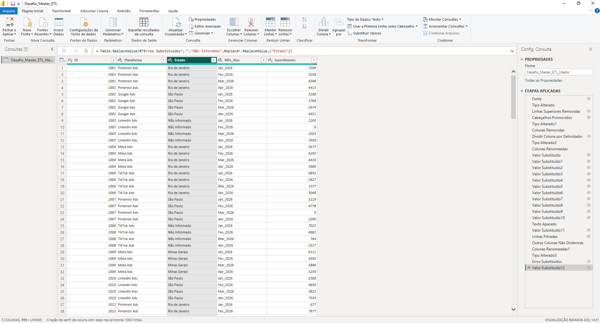

---

## 📊 Dia 05: Combinação de Dados (Append & Merge)

Neste dia, foquei em técnicas para consolidar e enriquecer bases de dados, simulando cenários reais onde as informações estão distribuídas em múltiplos arquivos.

### 📚 Conceitos Aplicados

* **Acrescentar Consultas (Append):** Utilizado para o empilhamento vertical de tabelas com estruturas idênticas. Consolidei históricos de vendas de diferentes anos (2023 e 2024) em uma única tabela fato.
* **Mesclar Consultas (Merge):** Realizei o cruzamento horizontal (semelhante ao PROCV/Join) entre a tabela de vendas e a tabela de cadastro de vendedores. Isso permitiu enriquecer os dados transacionais com informações de Região, Equipe e Comissões.
* **Otimização de Carga:** Apliquei a boa prática de desativar a carga das tabelas de apoio, mantendo apenas a tabela consolidada disponível para o relatório, economizando memória e performance.

**Resultado da Mesclagem e Expansão:** 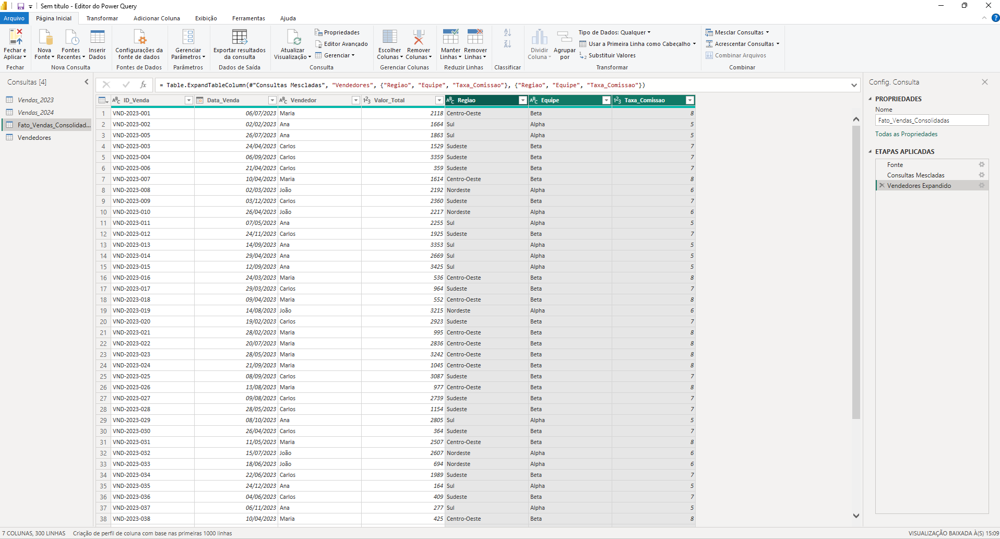

---
---

## 📊 Dia 06: Coluna Condicional e Lógica de Negócio

Neste sexto dia do desafio, foquei em dar "inteligência" aos dados brutos, implementando regras de decisão automáticas diretamente no Power Query para facilitar a análise estratégica.

### 📚 Conceitos Aplicados

* **Lógica de Negócio (If/Then/Else):** Implementação de regras condicionais para transformar valores numéricos em categorias legíveis e acionáveis.
* **Segmentação de Performance:** Criação da coluna `Status_Venda` para classificar automaticamente o faturamento entre Ticket Alto, Médio e Baixo, permitindo filtros mais eficientes no dashboard.
* **Linguagem M:** Observação prática de como o Power Query traduz a interface visual em scripts de transformação de dados (`Table.AddColumn`).

**Resultado da Lógica Aplicada:** .png)

---

---

## 📊 Dia 07: Modelagem de Dados (Star Schema)

Hoje dei o passo fundamental para a performance do dashboard: a transição do tratamento de dados para a modelagem lógica.

### 📚 Conceitos Aplicados

* **Star Schema:** Organização do modelo em tabelas de Fatos (eventos) e Dimensões (contexto).
* **Relacionamentos (1:N):** Configuração de chaves primárias e estrangeiras para conectar a dimensão `Vendedores` à `Fato_Vendas`.
* **Granularidade:** Entendimento de como o filtro flui das dimensões para os fatos, otimizando o cálculo de métricas.

**Modelo Lógico Final:** 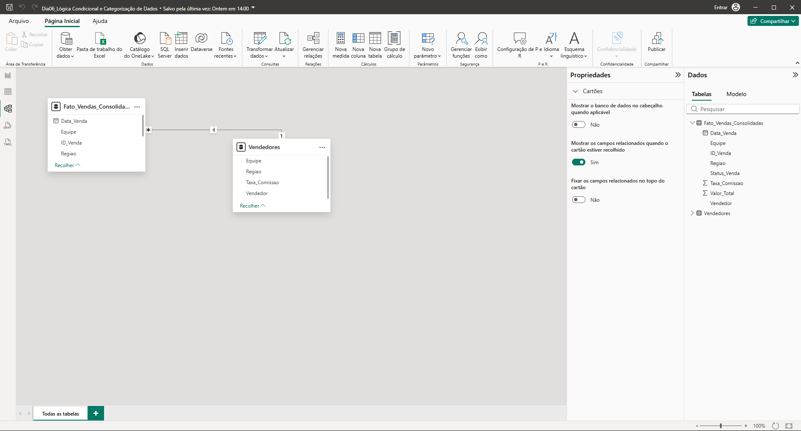

---

---

## 📊 Dia 08: Engenharia de Relacionamentos e Cardinalidade

Hoje finalizei a configuração técnica das "pontes" entre as tabelas, garantindo que o modelo Star Schema seja íntegro e performático.

### 📚 Conceitos Aplicados

* **Cardinalidade (*:1)**: Definição da relação onde muitos registros de vendas se conectam a um único cadastro de vendedor.
* **Direção de Filtro Único**: Configuração para que o fluxo de dados siga o padrão profissional, onde a Dimensão filtra a Fato.
* **Integridade Referencial**: Validação das chaves primárias e estrangeiras através da coluna `Vendedor`.

**Configuração do Relacionamento:** 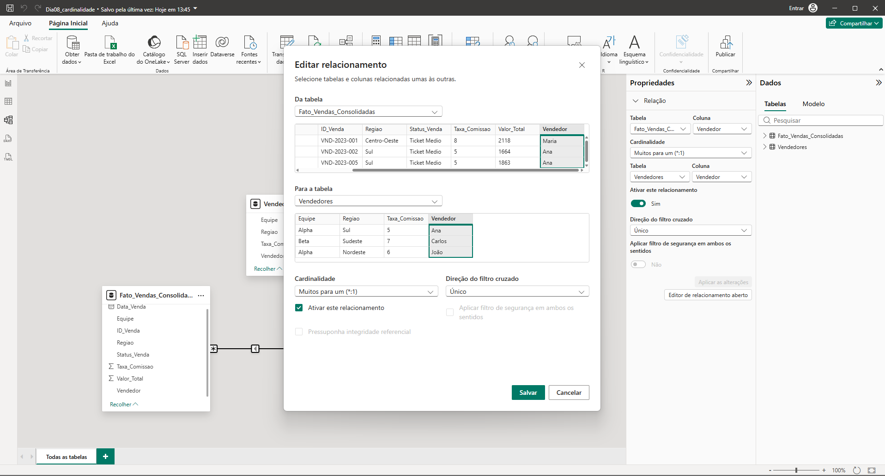

---

## 📅 Dia 09: Dimensão Calendário e Inteligência de Tempo

Nesta etapa, implementei a **D_Calendario**, a tabela fundamental para qualquer análise de evolução temporal. Ela funciona como a espinha dorsal do projeto, garantindo que não existam "buracos" na linha do tempo e permitindo comparações dinâmicas entre os anos de 2023 e 2024.

### 📚 Conceitos Aplicados

* **Linguagem DAX:** Criação da tabela utilizando um script otimizado com as funções `CALENDARAUTO` e `ADDCOLUMNS`.
* **Atributos de Tempo:** Extração automática de Ano, Mês Numérico, Nome do Mês, Trimestre e Dia da Semana para granularidade total nos filtros.
* **Arquitetura de Dados:** Consolidação do modelo **Star Schema**, garantindo que as dimensões filtrem a tabela fato de forma eficiente.

### 🛠️ Implementação Técnica

Para gerar a tabela de forma dinâmica e contínua com base nos dados existentes, utilizamos o seguinte bloco de código DAX:

**Script Utilizado:** 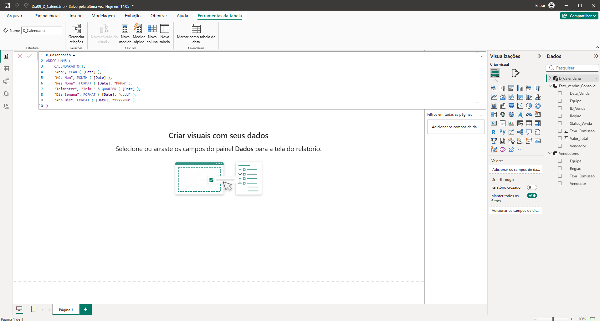

### 📐 Modelo Lógico Final (Star Schema)

Com a inclusão da dimensão de calendário, a "Estrela" do projeto está completa e relacionada. Agora, o modelo possui integridade referencial para suportar cálculos de **Time Intelligence**, como Total Acumulado e Crescimento Mensal.

* **Tabela Fato:** `Fato_Vendas_Consolidadas`
* **Dimensões:** `Vendedores` e `D_Calendario`
* **Relacionamento:** 1:N (Um para Muitos) entre as chaves de data.

**Estrutura do Modelo:** 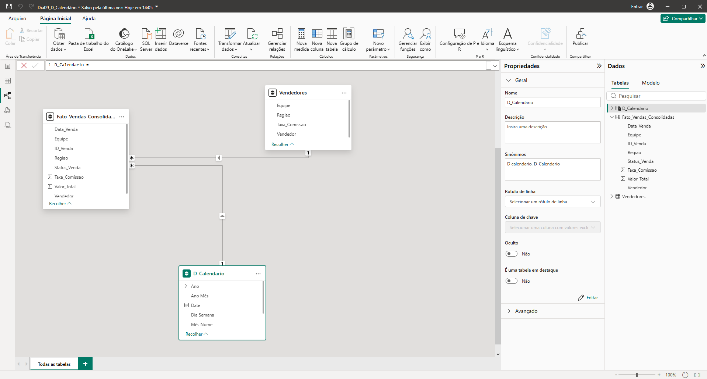

---
---

## 🧮 Dia 10: Introdução ao DAX e Contexto de Filtro

Hoje dei vida aos dados criando a "inteligência matemática" do dashboard através da linguagem DAX (Data Analysis Expressions).

### 📚 Conceitos Aplicados

* **Medidas vs. Colunas Calculadas:** Escolha estratégica por Medidas para garantir a performance do modelo, aproveitando o cálculo "on the fly" (Contexto de Filtro) em oposição ao cálculo linha a linha (Contexto de Linha).
* **Funções DAX Básicas:** Utilização das funções `SUM` e `COUNTROWS` para consolidar o faturamento e o volume de transações.
* **Interatividade Visual:** Criação dos primeiros elementos de interface (Cartões e Segmentação de Dados) para validar o funcionamento do relacionamento entre as dimensões e a tabela fato.

**Validação das Medidas e Filtros:** 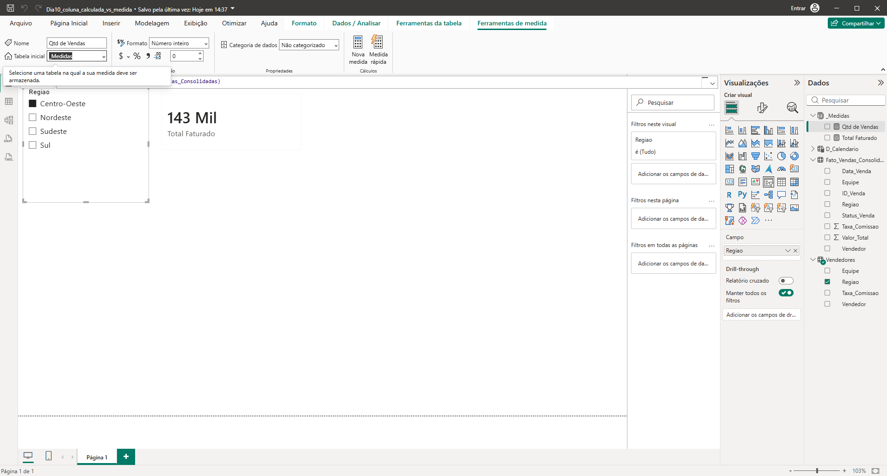

---

---

## ⏳ Dia 11: Inteligência de Tempo (Time Intelligence)

Hoje o dashboard subiu de nível com a introdução da Inteligência de Tempo. Agora o modelo não apenas soma o presente, mas consegue "viajar no tempo" para comparar o faturamento atual com o exato mesmo período do ano anterior.

### 📚 Conceitos Aplicados

* **CALCULATE:** Utilização da função mais poderosa do DAX para modificar o contexto de filtro da medida original.
* **SAMEPERIODLASTYEAR:** Aplicação de função de Time Intelligence para buscar os valores de faturamento de 2023 e colocá-los lado a lado com 2024.
* **Modelagem e UX:** Resolução de problemas clássicos de visualização, como a ordenação cronológica de meses (Janeiro, Fevereiro...) em vez de alfabética, utilizando a ferramenta "Classificar por coluna".

**Validação do Faturamento Ano a Ano (YoY):** 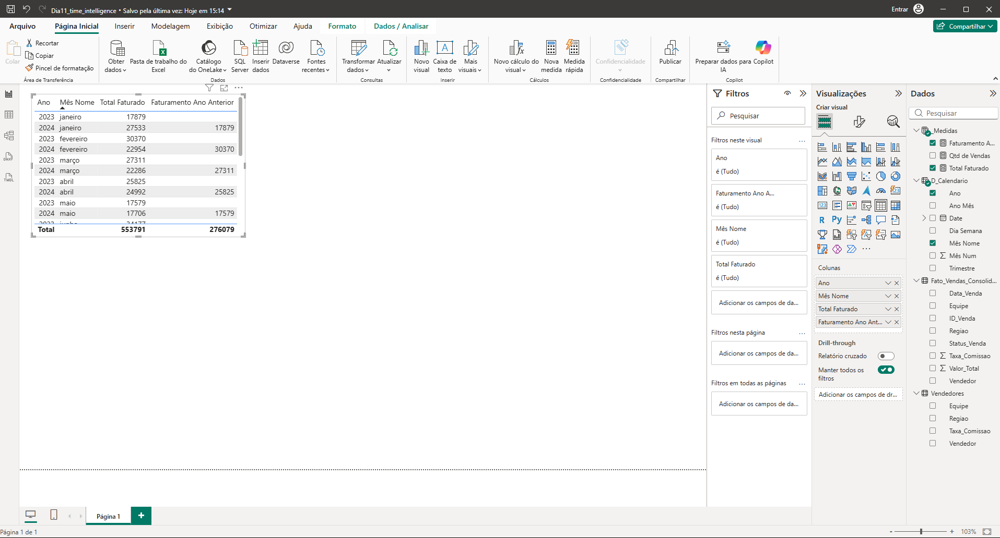

---
---

## 📈 Dia 13: KPI de Crescimento (Taxa YoY %)

Para complementar a análise visual do gráfico de faturamento, hoje foi implementado o principal KPI exigido por gestores de negócio: a Taxa de Crescimento Ano a Ano (Year-over-Year).

### 📚 Conceitos Aplicados

* **Matemática de Negócios no DAX:** Tradução da fórmula de variação percentual `(Atual - Passado) / Passado` para a linguagem do Power BI utilizando variáveis (`VAR` e `RETURN`) para manter o código limpo e performático.
* **Função DIVIDE:** Utilização da função de divisão segura do DAX para evitar erros no painel (como o erro de divisão por zero caso não houvesse faturamento no ano anterior).
* **Formatação e UI:** Aplicação de formatação de porcentagem e casas decimais no visual de Cartão, transformando decimais puros (0,01) em métricas de fácil leitura executiva (1,2%).

**Indicador de Variação YoY:** 

## 📊 Dia 12: Visualização de Dados (Gráfico YoY)

Hoje, os cálculos de Inteligência de Tempo ganharam forma visual. O modelo agora apresenta um gráfico executivo que compara o desempenho atual contra o passado de forma intuitiva.

### 📚 Conceitos Aplicados

* **Data Storytelling:** Escolha do Gráfico de Colunas e Linhas como a melhor ferramenta visual para comparar volume atual (barras) versus tendência histórica (linha).
* **Limpeza Visual (Clean Data):** Remoção de quebras de categoria (legendas no eixo) para criar barras sólidas e linhas contínuas, reduzindo a carga cognitiva na leitura do gráfico.
* **Interatividade Dinâmica:** Configuração de Segmentação de Dados (Slicer) em formato de lista vertical, permitindo que o usuário isolem o ano de análise (ex: 2024) enquanto a medida DAX `SAMEPERIODLASTYEAR` busca os dados correspondentes no passado.

**Gráfico de Faturamento Ano a Ano:** 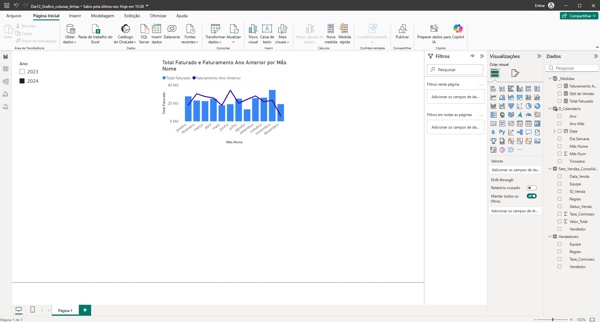

